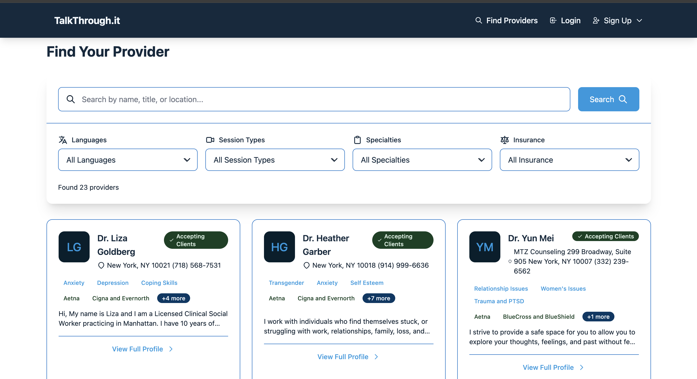
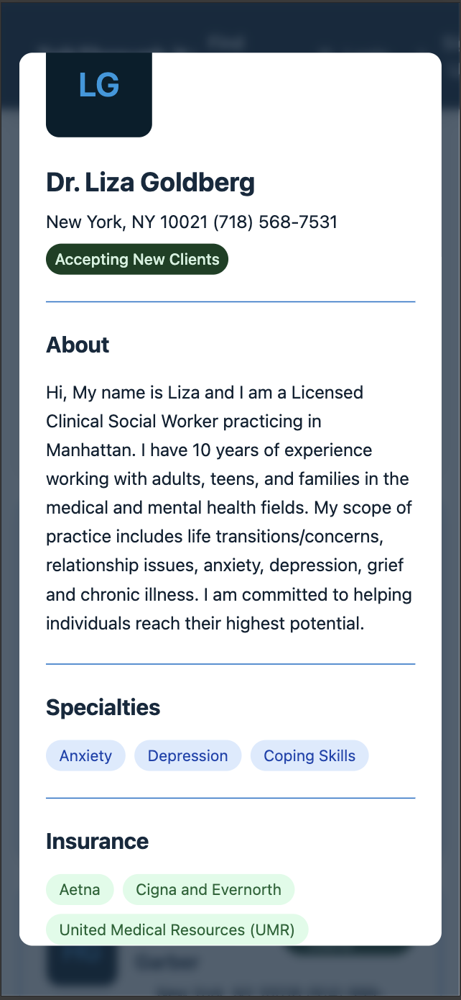

# TalkThrough.it

With the challenges of mental health issues facing the world today, our group decided to create a program that allows to connect both clients to liscened therapists, and for therapists to schedule and message their clients.

#### Desktop view

#### Mobile view

## Links
-  [Deployed website on netify](https://talkthroughit.netlify.app/)
-  [Backend Repo on github](https://github.com/Nottimlim/TalkThroughIt-Backend)
-  [Figma file, first draft](https://www.figma.com/design/1mdDZgBpzPngafp1hH5eL3/TalkThrough.it-Wireframe?node-id=3-3)
-  [Trello board, first draft](https://trello.com/b/TSManuaf/talkthroughit)

## Features

- Two different user experiences, one for therapists and one for clients.
- Without logging in, users can view therapists and read more before deciding to sign up with the website.
- Clients can view and filter therapists by Name / Location / Insurance Accepted / Session type (Video/Phone/In person) and more.
- Clients can bookmark/favorite. 
- Clients can book appointments based on the therapists availability.
- Clients can message therpaists.
- Therapists data was scraped from a public online database.
- TODO: what providers can do:

## Technologies used

- React/React Router
- Tailwind CSS
- MongoDB
- Express
- Node
- Puppeteer.js (for scraping therapist data)
- Figma/Figjam
- TODO: Packages used for the select fields/appointments etc

